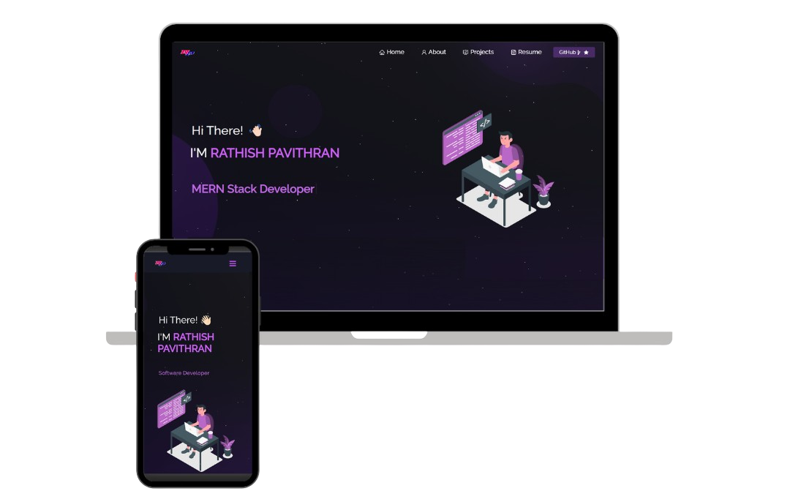

<h2 align="center">
  Portfolio Website - v2.0 
  <a href="https://rathishpavithran-portfolio.netlify.app" target="_blank">Rathish Pavithran</a>
</h2>

  

 
## Built With
This project was built using these technologies.

- React.js
- Node.js
- Express.js
- CSS3
- VsCode
- Netlify

## Features

**📖 Multi-Page Layout**

**🎨 Styled with React-Bootstrap and Css with easy to customize colors**

**📱 Fully Responsive**
